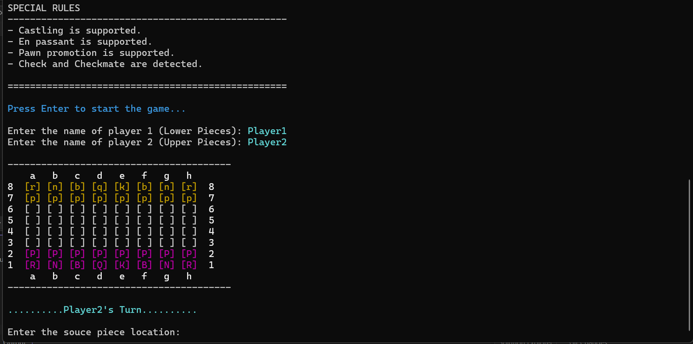
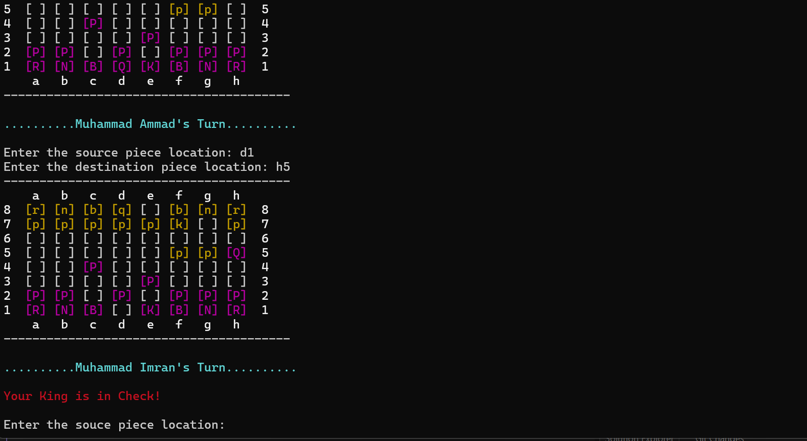
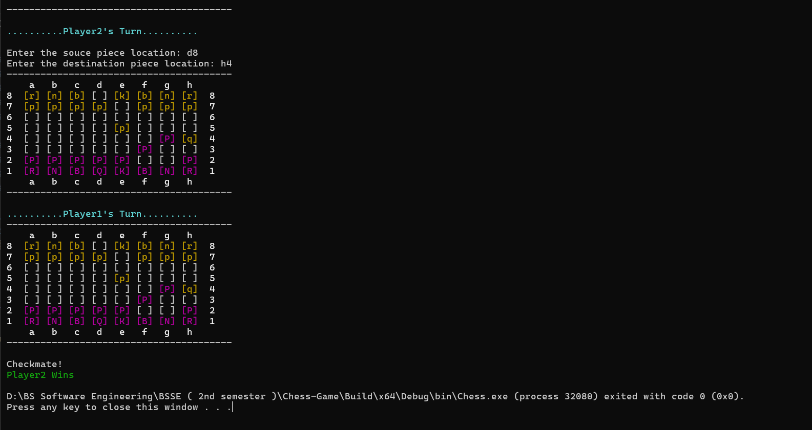

# ♟️ Console Chess Game

A fully functional **2-player console-based Chess game** developed in **C++** using **Object-Oriented Programming (OOP)** principles. The game follows the official rules of chess and focuses on clean architecture, modular design, and efficient move validation.

---

## Features

* ♟️ Two-player turn-based gameplay
* ✅ Complete legal move validation for all chess pieces
* 🚧 Path obstruction detection for sliding pieces (Rook, Bishop, Queen)
* 👑 Check detection
* 🏁 Checkmate detection
* 🏰 Castling
* ♙ En passant
* 👑 Pawn promotion
* ❌ Prevention of illegal moves
* 🎮 Console-based chessboard interface
* ✔️ Input validation and turn management

---

## Screenshots

## Technologies Used

* **Language:** C++
* **Programming Paradigm:** Object-Oriented Programming (OOP)
* **Application Type:** Console Application
* **Compiler:** Any C++17 (or later) compatible compiler

---

## Concepts Used

* Classes and Objects
* Inheritance
* Polymorphism
* Encapsulation
* Abstraction
* Virtual Functions
* Dynamic Memory Allocation
* STL Containers

---

## Project Structure

The project is organized into multiple classes, with each chess piece implementing its own movement logic. The game logic, board management, move validation, and rule enforcement are separated into different components to keep the code modular and easy to maintain.

---

## Learning Outcomes

This project helped strengthen my understanding of:

* Object-Oriented Programming in C++
* Complex game logic implementation
* Chess rule validation
* Class design and code organization
* Problem-solving and debugging

---

## How to Run

1. Clone this repository.
2. Open the project in your preferred C++ IDE (Visual Studio, Code::Blocks, CLion, etc.).
3. Compile the project using a **C++17** (or newer) compiler.
4. Run the executable.
5. Enjoy playing chess with another player in the console.

---

## Author

**M. Ammad**

---

